```{r setup, echo = F}
knitr::opts_chunk$set(
  comment = "#",
  #cache = TRUE,
  collapse = TRUE,
  warning = FALSE,
  message = FALSE,
  fig.width = 7,
  fig.height = 5.25,
  fig.align = 'center',
  fig.retina = 3
)

# base plot layout
mypar = list(mar = c(3,3,0.5,0.5), mgp = c(1.5, 0.3, 0), tck = -.008)

# xaringan Extra
xaringanExtra::use_xaringan_extra(c("tile_view", "animate_css", "tachyons"))
xaringanExtra::use_extra_styles(
  hover_code_line = TRUE,         #<<
  mute_unhighlighted_code = TRUE  #<<
)
xaringanExtra::use_editable(expires = 1)
xaringanExtra::use_panelset()
```
class: middle, title-slide

<!-- top logo (comment to remove or edit on `conf/css/style.css:23`) -->
<div class="lab-logo"></div>
<!-- <div class="bios2-logo"></div> -->

# Le rôle du climat et de la compétition sur l'aire de répartition des arbres

<hr width="65%" align="left" size="0.3" color="orange"></hr>

## Une approche multi-échelle de l'individu à la métacommunauté

### Willian Vieira

<br><br><br>
[<i class="fa fa-github fa-lg" style="color:#e7e8e2"></i> WillVieira/talk_PhDdefence](https://github.com/willvieira/talk_PhDdefence)

---

# Une curiosité générale pour comprendre <br> l'aire de répartition des espèces

<br>

.center[]

.cite[Map of the Voyage of Charles Darwin 1831 -1836, University of Illinois]

---

# Un besoin face aux changements climatiques

<br>

.center[]

.cite[McKenney et al. 2007 BioScience]

<!-- 
.center[] -->

---
# Modèle de communauté basé sur la<br>théorie de la métapopulation

<br>

.center[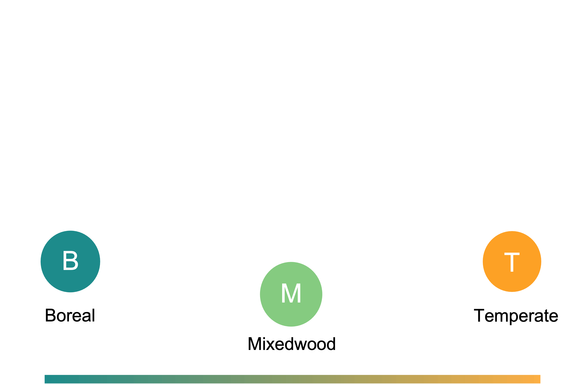]

.cite[Vissault et al. [2020](https://link) Journal of Biogeography]


---
class: animated, fadeIn

# Modèle de communauté basé sur la<br>théorie de la métapopulation

<br>

.center[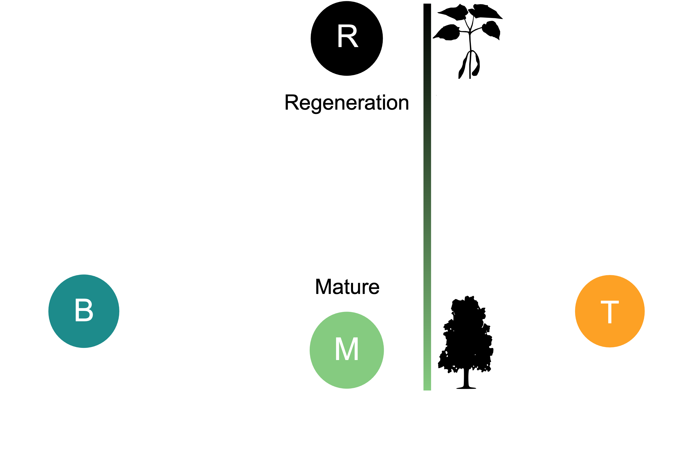]


.cite[Vissault et al. [2020](https://link) Journal of Biogeography]


---

# Modèle de communauté basé sur la<br>théorie de la métapopulation

<br>

.center[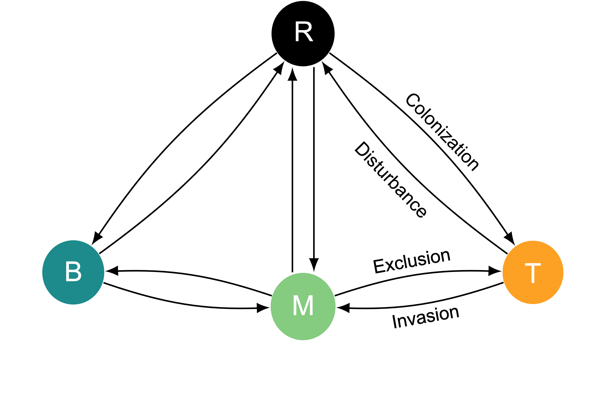]

.cite[Vissault et al. [2020](https://link) Journal of Biogeography]

---

# Modèle de communauté basé sur la<br>théorie de la métapopulation

<br>

De très bonnes prédictions avec peu de paramètres !

.center[]

.cite[Vissault et al. [2020](https://link) Journal of Biogeography]

---

# Modèle de communauté basé sur la<br>théorie de la métapopulation

Le réchauffement des températures réduira les <span style="color:#95c887">**forêts mixtes**</span>

.center[]

.cite[Vissault et al. [2020](https://link) Journal of Biogeography]

---
class: center, inverse, middle

#### Chapitre 1

<hr width="50%" align="center" size="0.3" color="orange"></hr>

### Comment l'aménagement forestier peut-il accélérer la réponse des forêts au changement climatique ?

---

# Quel est l'effet de l'aménagement forestier sur la vitesse de déplacement de l'aire de répartition ?

<br>

.center[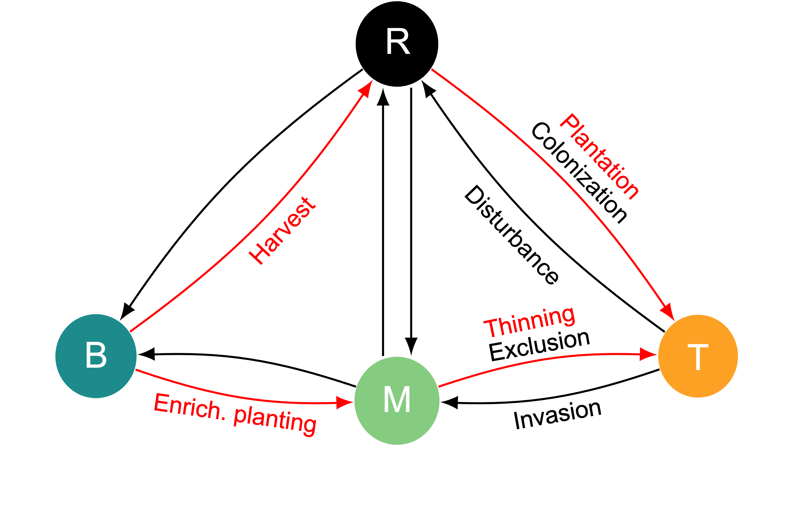]

---

# La plantation d'enrichissement est la pratique la plus efficace pour augmenter le deplacement

<br>

.center[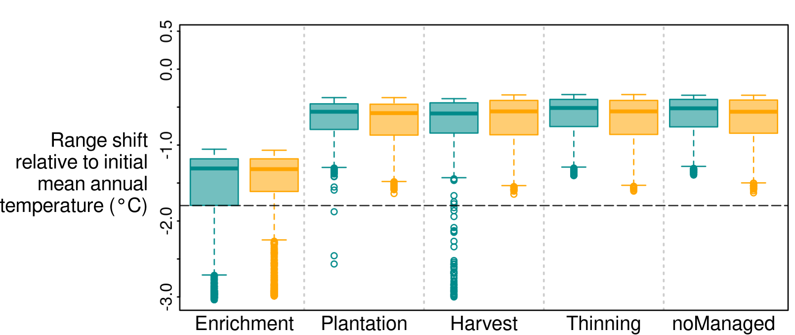]

.cite[Vieira et al. en révision]

---
# Conclusion Chapitre 1

.center[]

- ✓ La plantation d'enrichissement augmente le taux de déplacement et la résilience des état forestier soumis aux changements climatiques
- ✓ Ces résultats peuvent guider des futures travaille experimentales
- ✓ La réponse des états forestiers est plus sensible à la colonisation que à l'extinction
- 𐄂 Supposition majeur: les espèces d'un même état forestier réagissent de la même manière au climat et à la compétition

---
# Le taux de colonisation et extinction varie entre les **espèce** et dans leur **aire de distribution**

<br>

.center[

]

.cite[Talluto et al. 2017 Nature Ecology & Evolution]

---

# Lien entre les taux demographiques et l'aire de répartition d'une espèce

<br>

.font120[*r ~ Climat*]

.center[

]

.cite[Maguire Jr 1973 Am. Natur.; Holt 2009 PNAS; Fig adapted from Godsoe et al. 2017 TREE]

---

# Lien entre les taux demographiques et l'aire de répartition d'une espèce

<br>

.font120[*r ~ Climat + compétition*]

.center[

]

.cite[Maguire Jr 1973 Am. Natur.; Holt 2009 PNAS; Fig adapted from Godsoe et al. 2017 TREE]

---

# La corrélation entre **taux de croissance** et **occurrence** est faible pour la majorité des espèces

<br>

.center[

]

.cite[Le Squin et al. 2020 Global Ecology and Biogeography]

---
# La variabilité ne devrait pas être négligée

<br>

.center[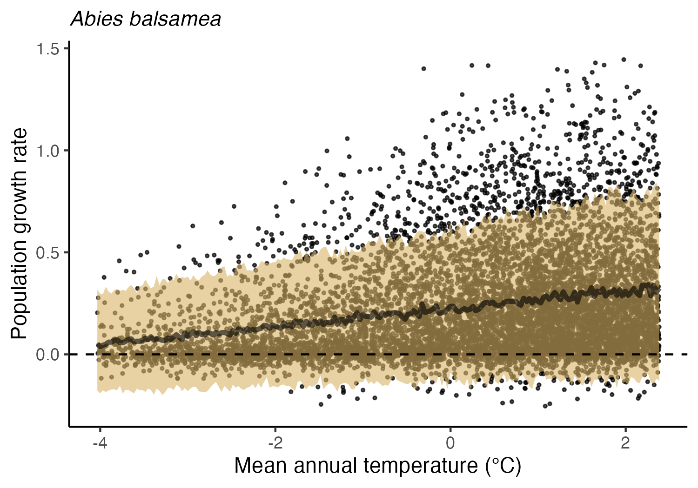]

---

# Les multiples sources de variabilité
 
.center[
  
]

.cite[Adapté de Shoemaker et al. 2020 Ecology]

---


# Les multiples sources de variabilité

.center[
  
]

.cite[Adapté de Shoemaker et al. 2020 Ecology]

---

# Les multiples sources de variabilité

.center[
  
]

.cite[Adapté de Shoemaker et al. 2020 Ecology]

---

# Les multiples sources de variabilité

.center[
  
]

.cite[Adapté de Shoemaker et al. 2020 Ecology]

---

# L'effet de la variabilité du taux démographique peut être <span style='color: #67a9cf;'>positif</span> ou <span style='color: #ef8a62;'>négatif</span> à une population

- <span style='color: #ef8a62;'>Risque d'extinction</span>

<br>

.center[
  
]

.cite[Holt et al. 2005 Oikos]

---

# L'effet de la variabilité du taux démographique peut être <span style='color: #67a9cf;'>positif</span> ou <span style='color: #ef8a62;'>négatif</span> à une population

- <span style='color: #ef8a62;'>Risque d'extinction</span>
- <span style='color: #67a9cf;'>Inégalité de Jensen</span>

.center[
  
]

---
class: center, inverse, middle


### .font80[Chapitre 2]:<br>Quelle est la sensibilité du taux de croissance au **climat** et à la **compétition**?

<hr width="100%" align="left" size="0.3" color="orange"></hr>

### .font80[Chapitre 3]:<br>Comment le taux de croissance varie<br>dans le gradient de température?

---
class: center, inverse, middle

## Le Modèle

<hr width="100%" align="left" size="0.3" color="orange"></hr>

---
# Le Modèle

<br>

.center[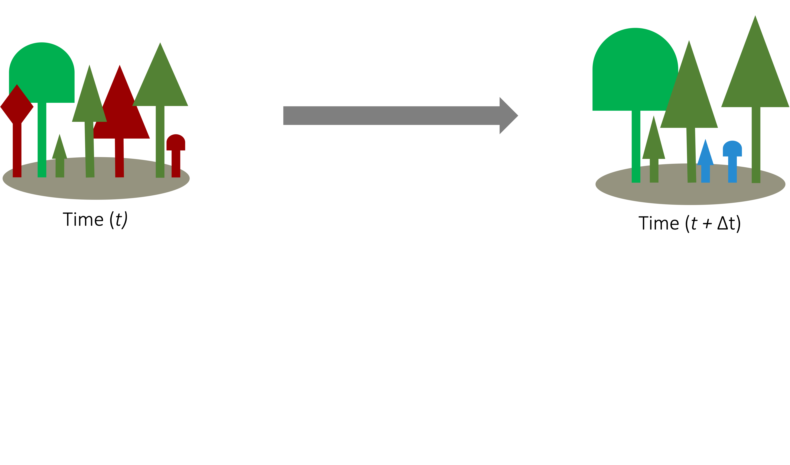]

---
# Le Modèle

<br>

.center[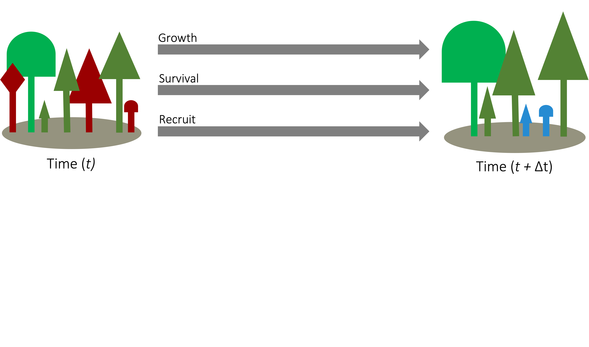]

---
# Le Modèle

<br>

.center[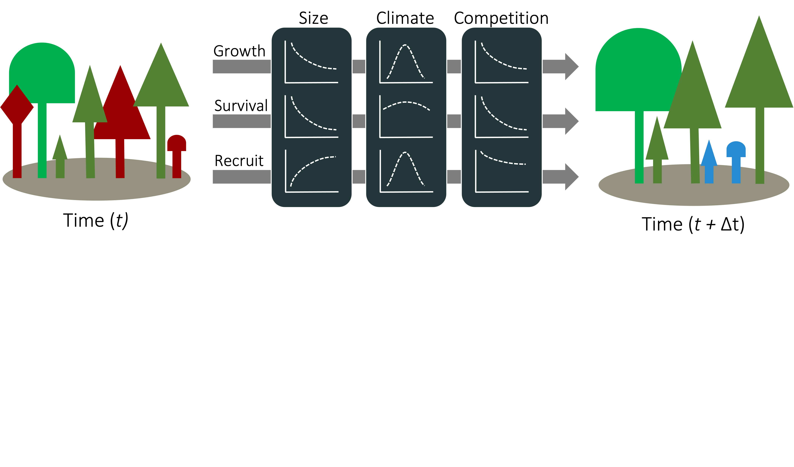]

---
# Le Modèle

<br>

.center[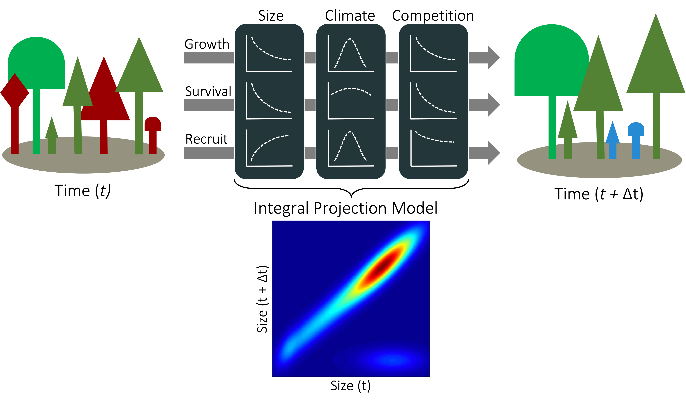]

---
# Le Modèle

<br>

.center[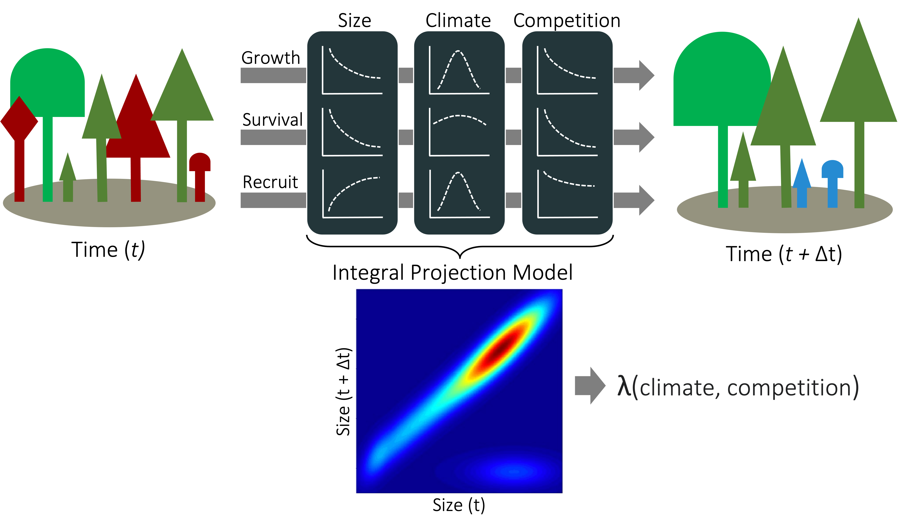]

---

# Les modèles démographiques

- Modèle de croissance de Von Bertalanffy (~ temps + taille de l'individu)

<br><br>

.center[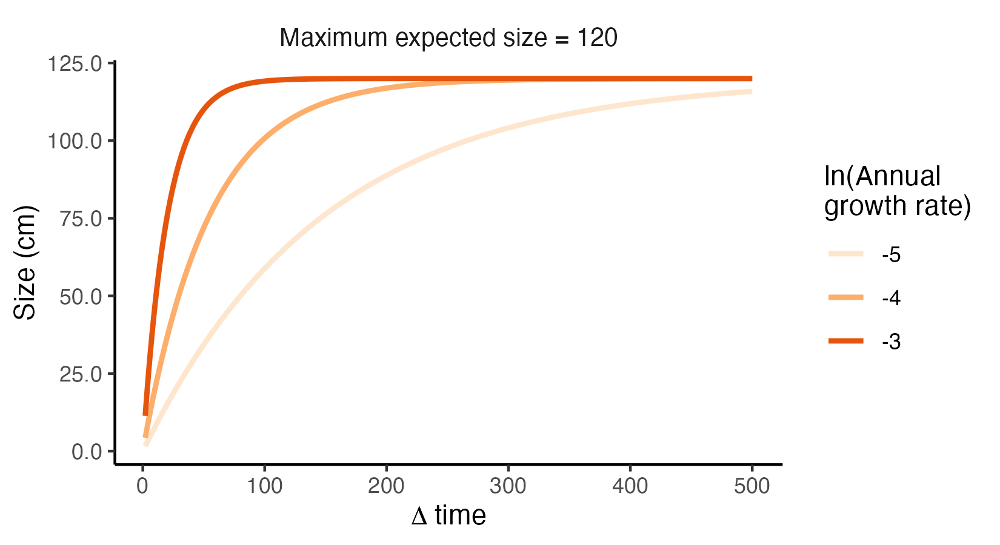]

---

# Les modèles démographiques

- Modèle de croissance de Von Bertalanffy (~ temps + taille de l'individu)
- Modèle de survie (~ temps)

<br>

.center[]

---

# Les modèles démographiques

- Modèle de croissance de Von Bertalanffy (~ temps + taille de l'individu)
- Modèle de survie (~ temps)
- Modèle de recrutement (~ temps + taille de la parcelle)

.center[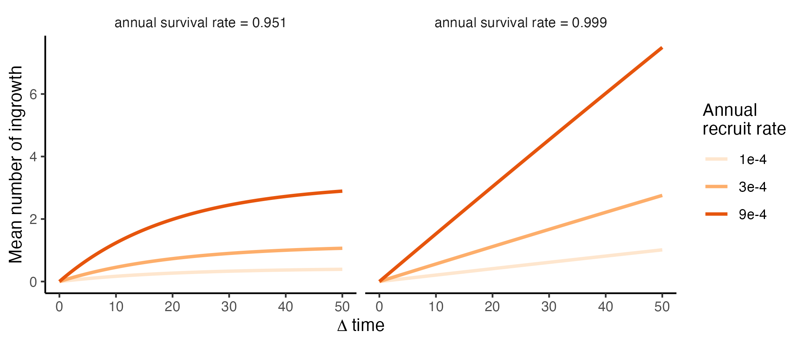]

---

# Les covariables - compétition

- $\beta$: l'effet total de la surface terrière des **individus plus grands**
- $\theta$: l'effet partagé entre conspécifique et hétérospécifique

.center[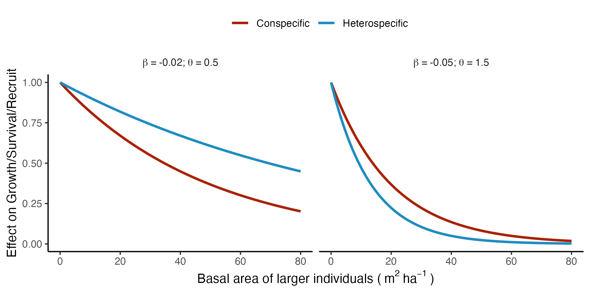]

---

# Les covariables - climat

Température moyenne annuelle + précipitation annuelle moyenne

- $\xi$: climat optimal
- $\sigma$: étendue de la niche

.center[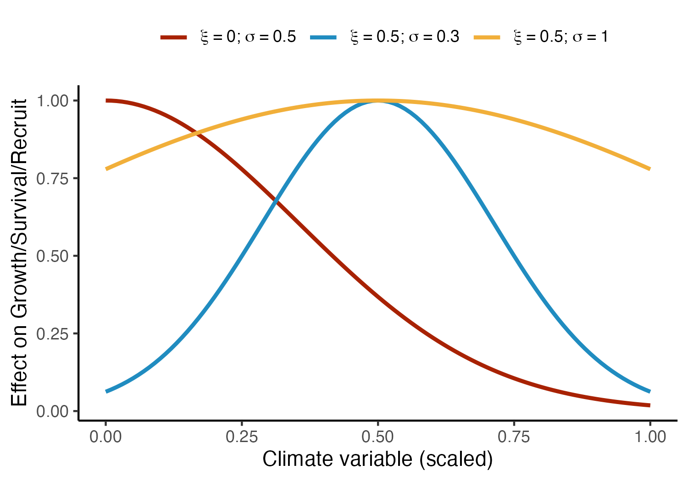]

---

# Paramétrisation

Parcelles permanentes d'inventaire forestier des <span style="font-weight: 400; color: #872d7b">Etats-Unis</span> et <span style="font-weight: 400; color: #4f2f8a">Québec</span>

.center[]

---

# Paramétrisation

- Parcelles permanentes d'inventaire forestier

  - 1970-2020 - Intervalle de ~5 ans
  - 31 espèces d'arbres
  - 22 feuillus + 9 conifères
  - Tolérance à l'ombre
  - Succession

--

- Modèles hiérarchiques non linéaires bayésiens

  - Hiérarchique: variance partitionnée à differentes échelles
  - non linéaire: modèles mechanistiques basés sur l'écologie
  - Bayésien: pour suivre l'incertitude

---

# Validation des modèles

**Croissance**: la taille maximale prédite pour une espèce est corrélée à la taille maximale des espèces trouvées dans la littérature

.center[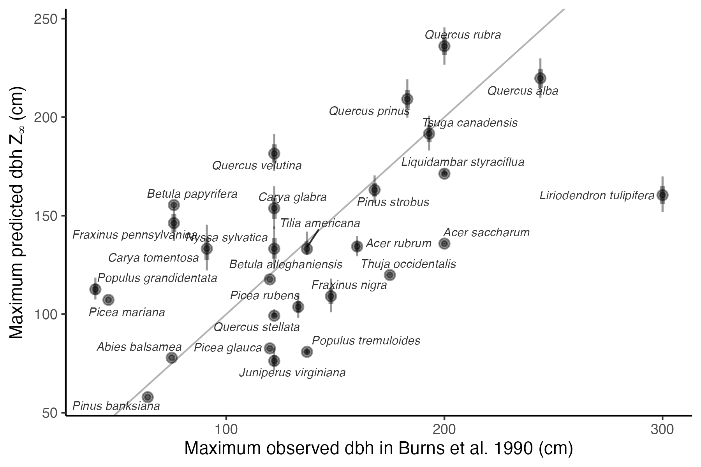]

---
# Validation des modèles

**Compétition**: l'effet de la densité augmente pour les espèces qui sont intolérante à l'ombre

.center[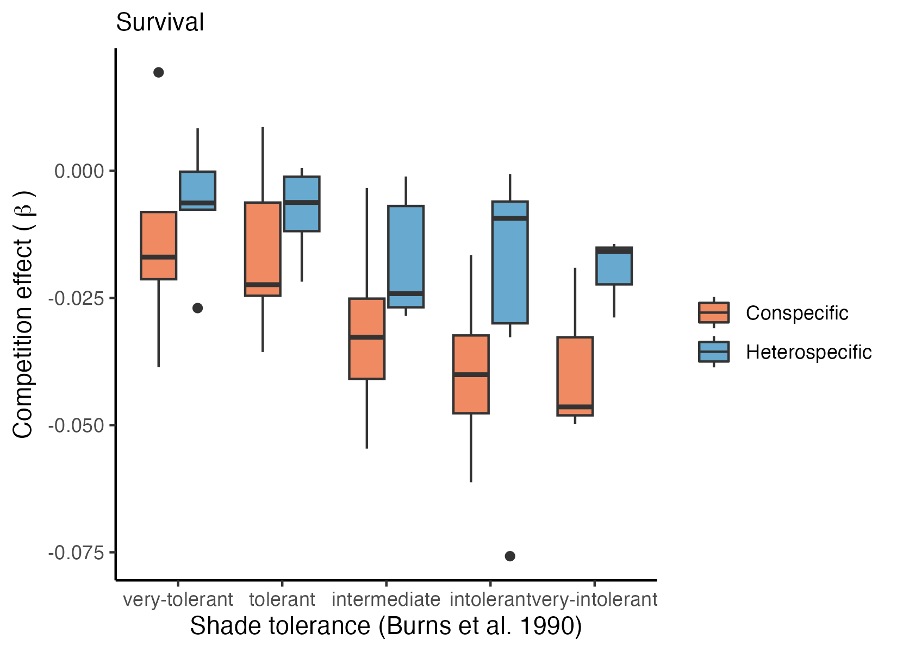]

---
class: center, inverse, middle

#### Chapitre 2

<hr width="50%" align="center" size="0.3" color="orange"></hr>

### 2.1. Quelle est la sensibilité du taux de croissance au **climat** et à la **compétition**?

### 2.2. Comment cette sensibilité varie dans <br>le gradient de l'aire de répartition?

---

# Analyse de perturbations

<br>

$$
	\frac{\partial \lambda_i}{\partial X_i} \approx \frac{\Delta \lambda_i}{\Delta X_i}
$$

.center[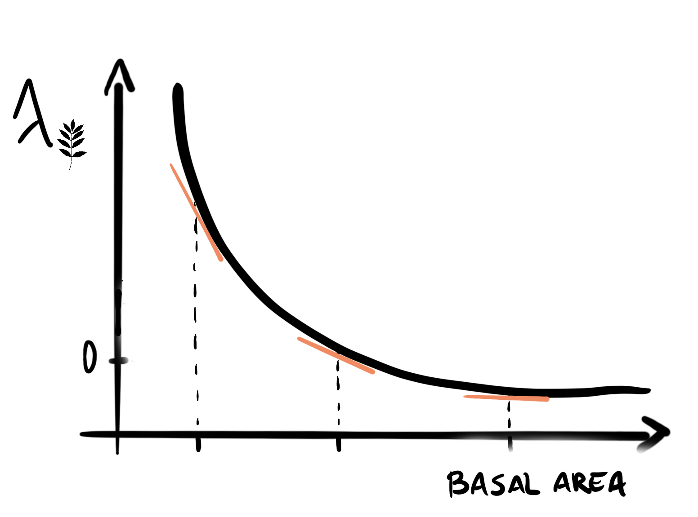]

.cite[Adapté de Caswell 2001 - LTRE]

---

# Analyse de perturbations

<br>

$$
	\frac{\partial \lambda_i}{\partial X_i} \approx \frac{\Delta \lambda_i}{\Delta X_i}
$$

.center[]

.cite[Adapté de Caswell 2001 - LTRE]

---

# $\lambda$ est plus sensible à la **temperature** suivi de la **compétition conspécifique**

<br>

.center[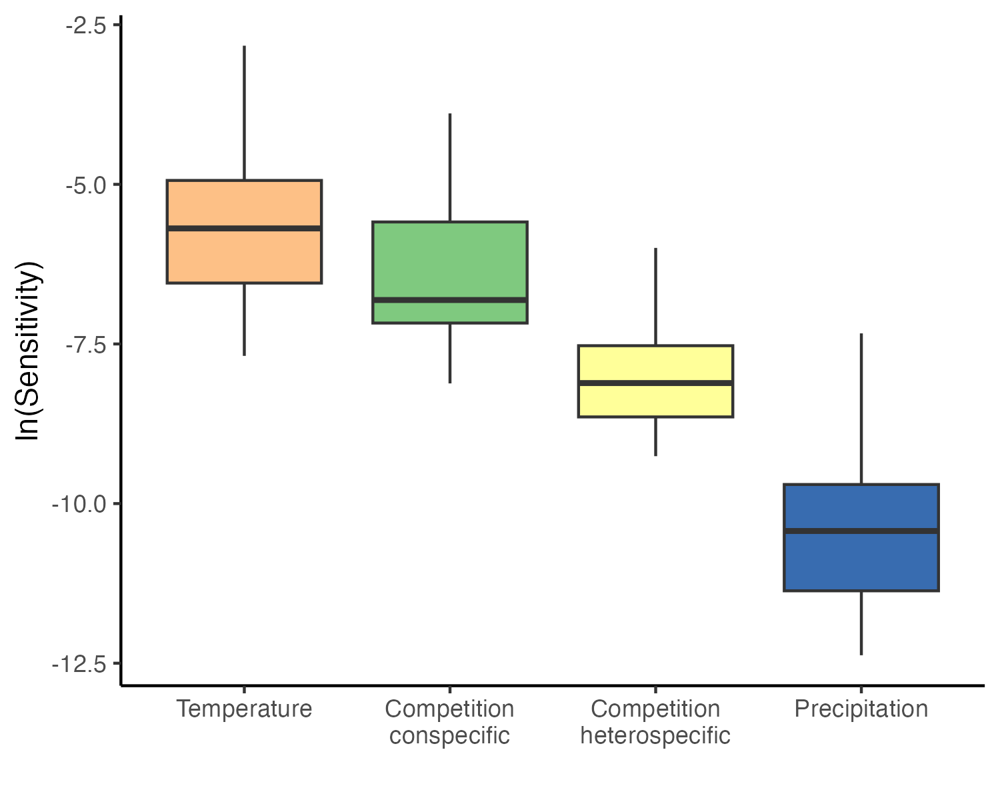]

---

# Comment la sensibilité varie dans le gradient de température ?

.center[]

---

# ↑ sensibilité à la competition dans la limite froide <br> ↑ sensitivité au climat dans les deux limites

<br>

.center[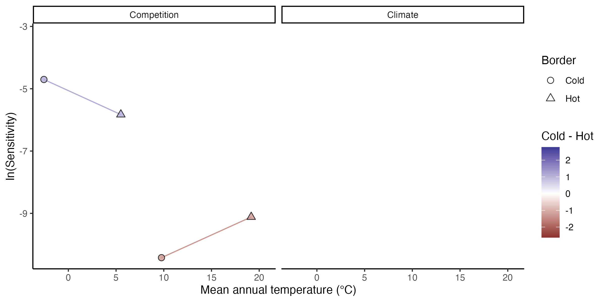]

---

# ↑ sensibilité à la competition dans la limite froide <br> ↑ sensitivité au climat dans les deux limites

<br>

.center[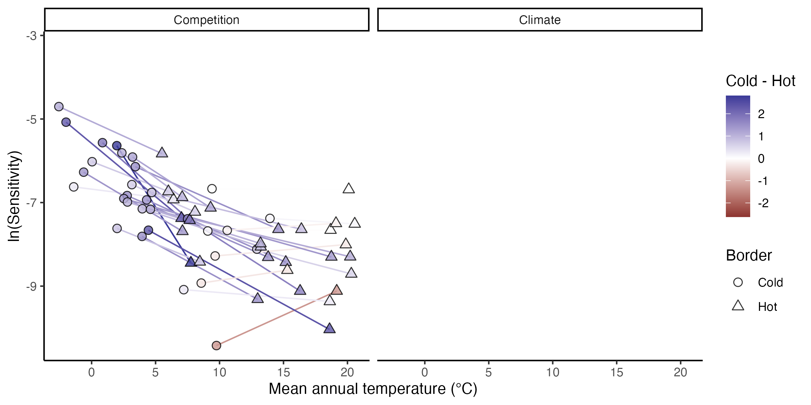]

---

# ↑ sensibilité à la competition dans la limite froide <br> ↑ sensitivité au climat dans les deux limites

<br>

.center[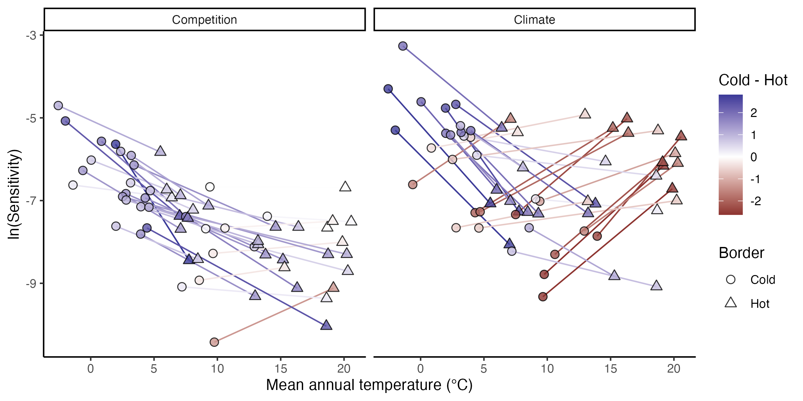]

---

# Conclusion

- Le taux de croissance ( $\lambda$ ) est plus sensible au climat que à la compétition
- La sensibilité du taux de croissance au climat augmente dans les bordures froides et chaudes
- La sensibilité du taux de croissance à la compétition augmente seulement dans la bordure froide

--

<br>

Permet de mieux comprendre l'effet
- **changements climatiques** (sensibilité au climat)
- **l'aménagement forestier** (sensibilité à la compétition)


---
class: middle, center, inverse

### Comment le taux de croissance ( $\lambda$ ) varie<br>dans le gradient de température?

<hr width="100%" align="left" size="0.3" color="orange"></hr>

---

# Les sources de variabilité en $\lambda$

<br>

.center[]

---

# Les sources de variabilité en $\lambda$

<br>

.center[]


---

# Les sources de variabilité en $\lambda$

<br>

.center[]

---

# Les sources de variabilité en $\lambda$

<br>

.center[]

---

# Les sources de variabilité en $\lambda$

<br>

.center[]

---

# Les sources de variabilité en $\lambda$

<br>

.center[]

---

# Les sources de variabilité en $\lambda$

<br>

.center[]

---

# Comment le probabilité de croissance ( $\Lambda$ ) varie<br>dans le gradient de température?

<br><br>

.center[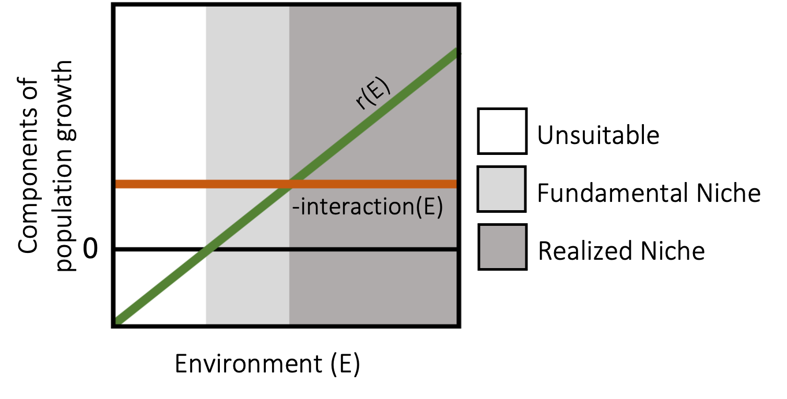]

---

# Distribution du taux de croissance dans le gradient de temperature

<br>

.center[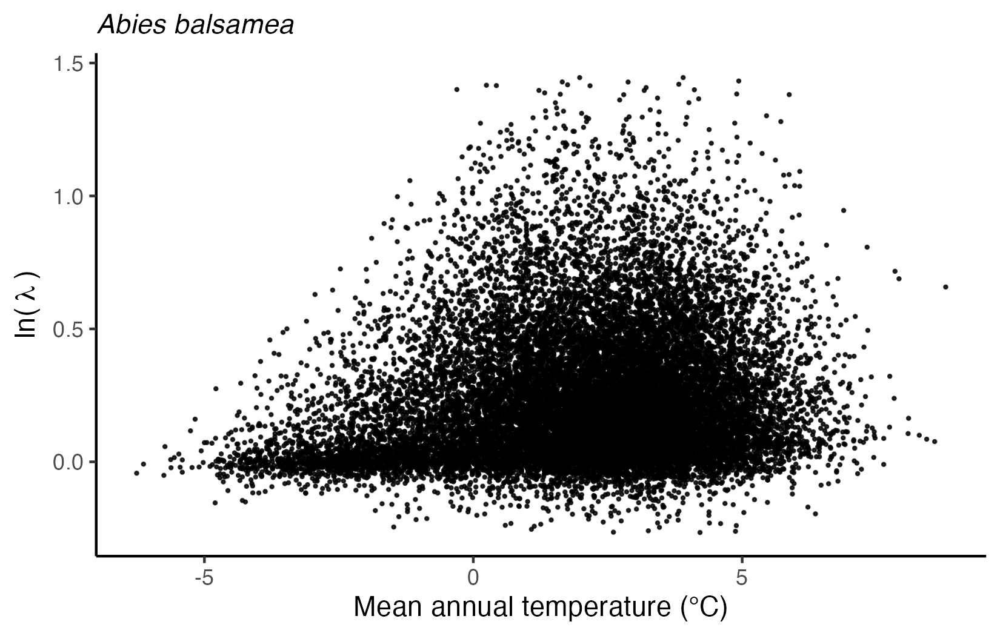]


---

# Distribution du taux de croissance dans le gradient de temperature

<br>

.center[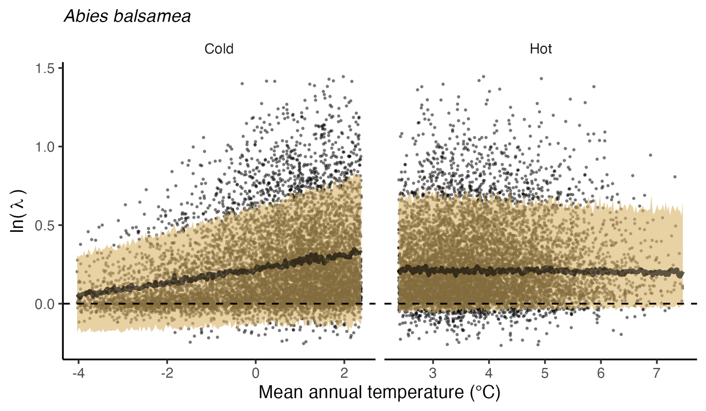]

---

# Distribution du taux de croissance dans le gradient de temperature

<br>

.center[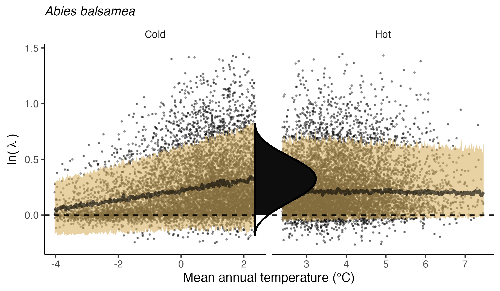]

---

# Distribution du taux de croissance dans le gradient de temperature

<br>

.center[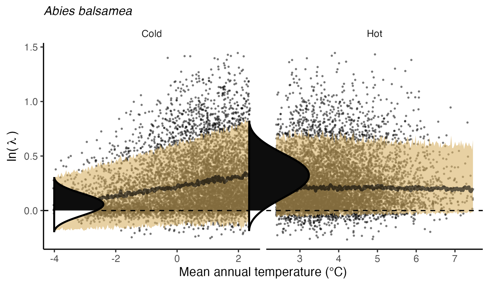]

---

# Distribution du taux de croissance dans le gradient de temperature 

<br>

.center[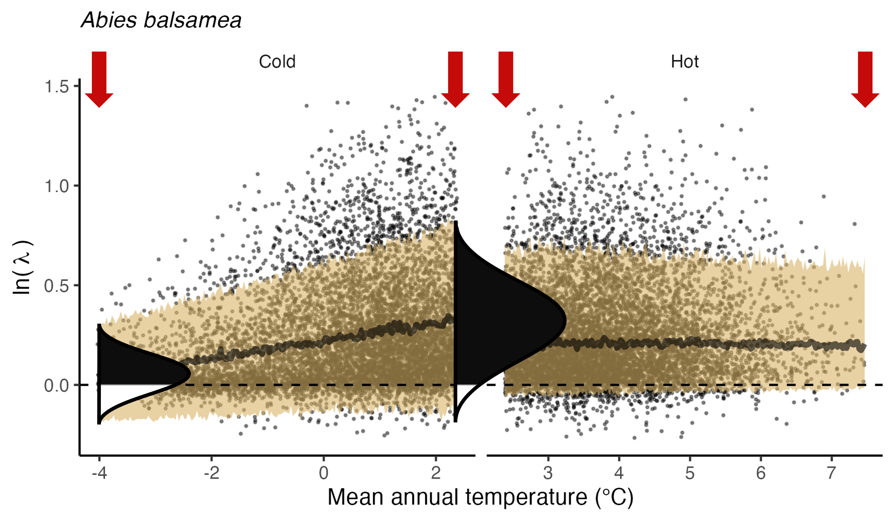]

---

# La probabilité de croissance ( $\Lambda$ ) reduit plus dans la limite chaude que la limite froide

<br>

.center[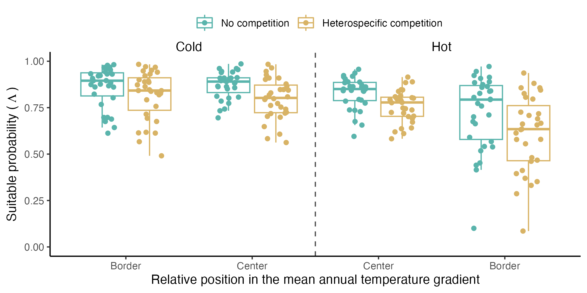]

---
# L'effet de la compétition sur la probabilité de croissance ( $\Lambda$ ) est plus grand dans la limite chaude

<br>

.center[]

---

# Conclusion

- la démographie est plus sensible au climat qu'à la compétition
- La sensibilité à la compétition est plus importante au centre

--
- La variabilité joue un rôle considérable dans la limite de l'aire de répartition
- Réconciliation des échelles
- Démographie + métacommunauté

$$
\frac{dp}{dt} = \alpha p (1 - p) - \varepsilon p
$$

---

class: inverse

.pull-left1[
<br>

# Obrigado !

<br><br><br>

**Dominique Gravel**

**Robert Bradley**

**Bill Shipley**

**Daniel Houle**

**Labo++**

**Amaël Le Squin**

**Andrew MacDonald**
]

.pull-right1[
<br>

]